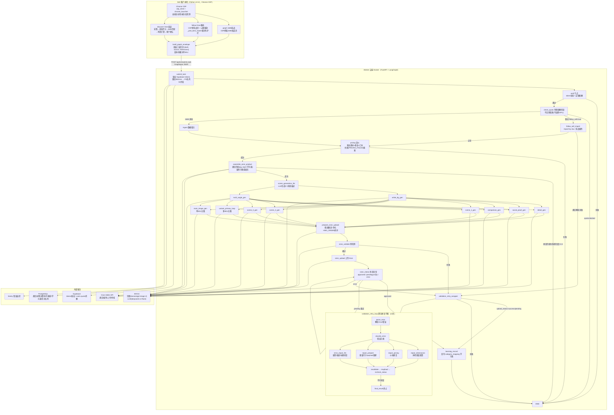
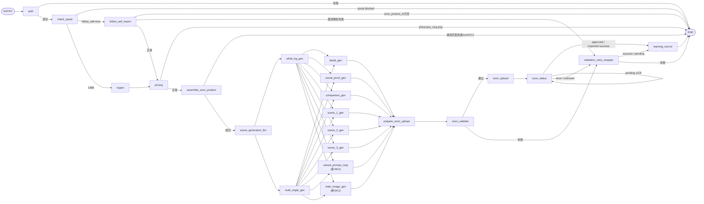
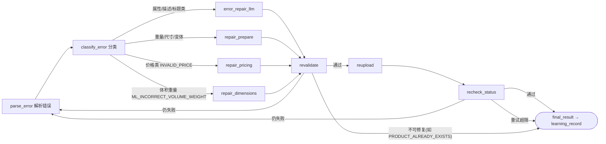
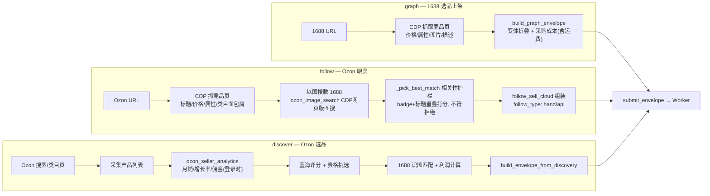

# 业务模型全景拓扑图

> 与 `worker/src/graphs/graph.py` 当前代码逐节点核对（v0.27.0）。看完这张图就能理解整个业务模型。
> 旧版 `docs/WORKER-TOPOLOGY.md` 的拓扑段落已过时（v0.11），以本文为准。

---

## 0. 一图流（ASCII 全景）

```
┌─────────────────────────── Skill（客户本地，Python≥3.12） ───────────────────────────┐
│                                                                                      │
│   Chrome CDP 通道（cdp_client + chrome_launcher，自动启动/登录/反检测）               │
│                                                                                      │
│   ┌─ graph（1688选品）──▶ CDP抓1688商品页 ─┐                                          │
│   │                                        ├─▶ build_graph_envelope ──┐              │
│   ├─ follow（Ozon跟卖）─▶ CDP抓竞品页 + 以图搜款(1688同款) ─┐            │              │
│   │                      （_pick_best_match 相关性护栏）    ├─▶ 组装信封 ─┼─▶ submit    │
│   ├─ discover（Ozon选品）▶ 搜索/类目页采集 → 蓝海评分 →     │           │  (POST)       │
│   │                      1688匹配+利润计算 → 用户确认       ┘           │              │
│   └─ image_search / check / get_ak / batch_test                       │              │
│                                                                       ▼              │
└──────────────────────────────────────────────────────────────────────────────────────┘
                                                        GraphInput 信封 JSON
                                                         {draft, source, extensions}
                                                        token / ozon_client_id / ozon_api_key
                                                                    │
                                                                    ▼
┌─────────────────────────── Worker（云端 Docker：Worker + PostgreSQL） ─────────────────┐
│                                                                                      │
│   POST /api/v1/submit_task ─▶ 鉴权(Supabase tokens) ─▶ 限流(300/min) ─▶ PG队列        │
│        (ozon_product_tasks, FOR UPDATE SKIP LOCKED) ─▶ 50并发 LangGraph              │
│                                                                                      │
│   auth → check_quota ─┬─▶ follow_sell_import（跟卖）                                  │
│                       └─▶ ingest（1688 直采）                                        │
│                            │                                                          │
│                            ▼                                                          │
│   pricing（定价失败阻断）→ assemble（类目匹配失败阻断）→ scene_generation_llm          │
│                            │                                                          │
│                            ▼                                                          │
│   Phase1 并行: white_bg_gen ──┐                                                       │
│                multi_angle_gen─┤                                                      │
│   Phase2 并行: detail/social_proof/comparison/scene_1/2/3                             │
│                + variant_primary_loop(多SKU) 或 main_image_gen(单SKU)                 │
│                            │                                                          │
│                            ▼                                                          │
│   prepare（翻译/净化/排序）→ ozon_validate ──▶ ozon_upload ─▶ ozon_status             │
│                            │失败                     ▲           │                   │
│                            ▼                         │           ▼                   │
│                    validation_retry_wrapper ◀────────┴─ 修复循环 │                   │
│                    （靶向修复子图，≤3次）                            │                  │
│                            │                                   │approved             │
│                            ▼                                   ▼                      │
│                    learning_record（自学习回写 category_mapping）                     │
│                                                                                      │
│   PG: category_tree_nodes / logistics_rates / dictionary_value_cache /               │
│       category_mapping / size_mappings / ozon_product_tasks / progress               │
└──────────────────────────────────────────────────────────────────────────────────────┘
```

---

## 1. 全景业务模型（Mermaid）



---

## 2. Worker 节点流（精确版，与 graph.py 逐行对应）



> **两条管线的汇合点**：跟卖（`follow_sell_import`）与直采（`ingest`）在 `pricing` 汇合，
> 之后共用完全相同的「定价 → 组装 → 生图 → 上传 → 审核 → 学习」流水线。
> **唯一区别**：`assemble` 对跟卖走 `_assemble_follow_sell` 轻量模式（复用竞品属性+类目），
> 对直采走 `_build_items_deterministically` 完整模式。

---

## 3. 修复循环子图（validation_retry_loop，最多 3 次）



> **靶向修复原则**：有 `product_id` 时用增量 API（`/v1/product/attributes/update`、
> `/v1/product/prices/update`），**不重跑全管线**（不重新生图/LLM）。无 `product_id` 才走 CREATE 模式。

---

## 4. Skill 三条管线细节



---

## 5. 数据表 & 状态流转

### PG 核心表（`worker/src/storage/database/`）

| 表 | 用途 | 读写方 |
|----|------|--------|
| `category_tree_nodes` | 7424 类目中俄双语（同一 ID 跨语言一致） | init_data 导入 / 类目匹配读 |
| `logistics_rates` | 物流费率（定价用；为空时兜底费率虚高 3-4 倍⚠️） | init_data 导入 / pricing 读 |
| `dictionary_value_cache` | 属性字典值缓存（JSONB，ZH_HANS↔RU 同一 dict_id） | assemble / retry 读写 |
| `category_mapping` | 类目学习表（跟卖/直采优先查，approved 后回写） | follow/assemble 读，learning_record 写 |
| `size_mappings` | 尺码表（4 张 CSV 随镜像分发） | size_mapper 读 |
| `ozon_product_tasks` | 任务队列（FOR UPDATE SKIP LOCKED） | submit 写 / worker 消费 |
| `progress` | 任务进度持久化（重启恢复） | task_processor 写 |

### 成功判据（v0.21 收紧）

```
learning_record 只认: moderate_status == "approved"
（imported 即 success / pending+product_id 视为成功 —— 均已删除）
```

### 错误码

统一在 `worker/src/api/errors.py`（12 个 `WorkerErrorCode`）：`INVALID_REQUEST`、`AUTH_FAILED`、`QUOTA_BLOCKED`、`PRICING_FAILED`、`CATEGORY_MATCH_FAILED` 等。

---

## 6. 关键设计决策速查

| 决策 | 内容 |
|------|------|
| 类目匹配 | 不用 LLM：pg_trgm 相似度 + jieba 分词末级 + 同义词表 + 学习表优先 |
| 字典属性 | 绝不手填文本，未匹配 → 跳过（报「请从列表中选择」的根因已修） |
| 中文零容忍 | 必填俄语属性含中文 → 跳过；描述净化移除拉丁/中文/营销词 |
| 危险品 9782 | 只挑「非危险」安全默认，不取第一个字典值 |
| 定价失败 | 阻断上架，不兜底 ¥1000 |
| 跟卖双模式 | hand（CREATE 重建防侵权）/ api（import-by-sku 复制）；offer_id 统一 `follow_{竞品ID}` |
| 竞品图 | 禁上传竞品 ir.ozone.ru 图补位（0 图下架根因） |
| 尺寸防线 | draft_sanity 入队拦截 weight>50kg/单边>5m；cm→mm 阈值 200 |
| 鉴权余额 | 用 `users.quota`，绝不用僵尸字段 `tokens.remain_quota` |
| 生图模型 | main/social_proof 用 gpt-image-2，其余 banana；提示词外置热加载 |
