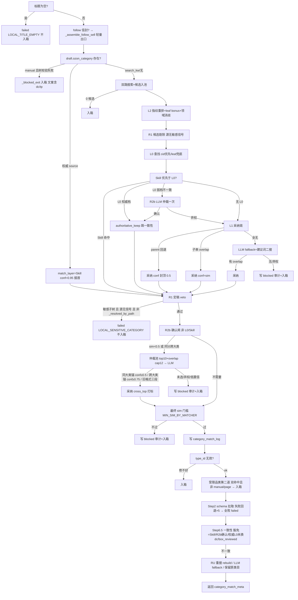

# 03 · 类目链：信任序 / 决策树 / 学习闭环

> 范围：`worker/src/graphs/nodes/assemble_ozon_product_node.py`（下称 A）、`worker/src/utils/ozon_category_query.py`（O）、
> `learning_record_node.py`（LR）、`local_db_manager.py`（L）、`validation_retry_loop.py`（V）。
> 信任序：**权威 Skill（page/what_to_sell/mapping/manual）→ L0 学习表（curated / learned succ≥2）→ L1 文本 jieba → R2b LLM 仲裁**；R1 敏感 veto 覆盖一切。

## 1. 信任序实现要点

| 层 | 判定 | 锚点 |
|---|---|---|
| Skill 直采解析 | `draft.ozon_category` 三形态（数字 dc/tp、路径、Web id）；path 先查 `web_category_path_map`（A:1352-1383）再树精配 `_resolve_skill_category:1119`（`_resolved_by_path=True/False`） | A:1119-1383 |
| `_is_skill_authoritative` | source ∈ {page,mapping,what_to_sell,manual} 权威；widget 仅路径精配才权威；**search_kw 恒 False**（模糊猜测，只当普通候选队尾 `_place_skill_candidate:599`） | A:578-589 |
| manual 校验失败 | **显式阻断** `_blocked_exit`（文案含 dc/tp，入箱）；page/what_to_sell/mapping 不过则静默退回文本链 | A:1393-1403 |
| `_skill_precedence_over_l0` | manual 恒接管（含 L0 一致场景）；dc/tp 冲突→Skill 赢；一致→保留 L0 | A:620-670 |
| L0 门槛 | `(cid 优先, leaf 兜底)` 查 `category_mapping`：success_count≥1 且 confidence≥0.6，且 dc/tp 在树中 | A:4195-4240 |
| `_l0_authoritative` | curated 恒权威；learned succ≥2 权威；**succ==1 弱档**（新叶子前 1-2 单不独立权威） | A:171-188 |
| `_l0_guard_action` | authoritative_keep（跳一致性丢弃）/ consistent_keep（与文本 top5 一致）/ arbitrate（弱档不一致 → R2b LLM 仲裁一次，确认提为权威，否则丢 L0 回 L1） | A:213-234, 534-575, 1699-1713 |
| match_layer 值域 | "Skill"(conf 0.95) / "L0"(0.95) / "L1"(默认) / "R2b"(**仅 retry 侧 R4 写入** V:1219) / "blocked"(仅审计行) | A:1626/1656/1754, V:1221 |

## 2. 决策树（assemble 主链）

- 受限品类闸与 R1 **刻意分开**：双命中才拦、`manual/page` 豁免（`_trusted_category_source` A:1524）、入口两道（A:1511/A:2065）。
- 入箱统一 `_blocked_exit:819` → `blocked_draft_box.create_blocked_draft`（tenant+item_id 幂等且无任何 draft_submissions 行）；**R1 veto 与标题空刻意不入箱**（红线）。

## 3. L1 文本链（ozon_category_query.py）

- 分流 `search_nodes:390`：ZH+jieba → `_search_jieba_like:573`；否则 pg_trgm（sim≥0.3）→ ILIKE 回退(:486)。
- jieba 链：分词→剥 `_MODIFIER_WORDS:197`（成人/儿童/宝宝…）与泛词→同义词扩展（category_synonyms.json）→ 单字兜底 `score_residual_rows:347`（相等 1.0/前缀 0.7/包含 0.6/仅 path 0.5）→ 逐 token ILIKE(escape_like) → **核心 token 必须命中 node_name**（:669，防「成人帽→成人用品18+」子树拖入）→ 单 token `_score_token_hit:284`（==1.0/前缀 0.7/包含 0.6）；多 token AND +1.0、depth bonus、exact 加分 0.95/0.8（:315）。
- L2 指纹重排 `score_candidates_by_fingerprint:1328` + assemble 侧 leaf bonus（A:113）+ 汽车/摩托消歧（A:253）。
- `MIN_CONF_BOX=0.3`（O:312）唯一事实源——route_after_assemble 消费。

## 4. R4 declined 换类目（V）

- 分类信号 `_looks_like_category_mismatch:1005`：attr 22507 恒真；8229+INVALID_ATTRIBUTE_VALUE/MISSING_*/INVALID_CATEGORY；文本含 `категор/тип не соответствует/группа товаров`；排除中文码与值数超限。
- `_try_recategorize_card:1104`：1688 源词（title→source_cat→RU name 三级）search_nodes → R1/R2 规则过滤 → 必须换 (dc,tp) → `_rebuild_for_new_category:2645`(A) 重建 → meta={"match_layer":"R2b","confidence":0.7} → 旧行负反馈。
- **box_reviewed 恒禁**（V:1112）；无解 → `needs_recategorization` 硬收敛 `LOCAL_CATEGORY_RECATEGORIZE_FAILED`（V:3456-3471）。

## 5. 学习闭环

**读**：assemble L0 分档（§1）；follow/main 精确映射端点 `lookup_mapping` 用更严门槛 succ≥3（CML:16-17）——与 assemble 分档**刻意不同**。
**写**（approved 分支 LR:381-707）：
- 学习门（PR-0）：fetch_back `erased/defaulted_by_ozon` 不写（LR:459-496，防 Goodhart 棘轮）。
- **写侧语义预检 `_leaf_path_overlap`（LR:35-53）**：jieba 去泛词后与 ZH 路径零重叠拒写。
- **L0 自证防护**：match_layer=L0 且 dc/tp 未变 → skip upsert；dc 已换 → 0.7。
- 分档 conf：Skill 0.9 / L1·R2b 0.7 / 缺省 0.85 / 真跟卖压 0.6 / match_evidence 非 aibuy 且 conf<0.3 压 0.6（LR:653-677）。
- `add_category_mapping`（L:592-745）：原子 upsert（(leaf,dc,tp) 唯一键）；同 (cid,dc,tp) 异措辞归并不裂行；curated 不被 learned 降级；**W11 全局共享无 tenant**。
**负反馈**（declined）：`final_result` 挂 `_mark_category_negative_feedback`（V:4183→:1057→L:747-814）：fail+1；**learned 累计 3 次 is_active=False 下线；curated 只 +1 恒 active**。LOCAL_TITLE_CATEGORY_MISMATCH 刻意不记负反馈（V:4119-4141）。

## 6. 类目数据源

- `category_tree_nodes` 扁平表（(dc,tp,language) 唯一，pg_trgm GIST）；表空从 category_cache JSONB 同步（**当持久化参考，不检查过期** O:973）。
- `set_category_cache` 默认 TTL=**315360000s≈10 年**（L:330）——AGENTS 的「category_cache 90d」口径与代码不符（09-文档漂移）。
- `warm_category_cache.py`：attribute_cache/dictionary_value_cache TTL 30d；三桶；warm_dead_nodes（400 永久跳过）；覆盖率审计。
- cold start：新叶子 succ==1 弱档；follow/main 端点需 succ≥3。

## 7. 疑点（并入 09-findings §类目）

1. match_layer="R2b" 只在 retry 产生；assemble 内 R2b 确认后仍是 "L1"，`_r2b_confirmed` 只活在内存——R2b 采纳率无法按列统计。
2. web 面包屑映射直通复用 `_resolved_by_path=True` → 自动获得 **R1 唯一豁免**；学习表污染被 approved 固化时该通道会把错行升级成 R1 豁免（语义面比实现宽）。
3. 权威档 L0/Skill **完全跳过 R2b**（A:1923）——权威错配无 LLM 复核，第一次错配由 Ozon declined 买单。
4. confidence 只升不降（conflict 侧 greatest，L:704）——弱档判定全靠 success_count，lookup 的 MIN_CONFIDENCE=0.6 门槛形同虚设。
5. blocked 入箱幂等：已提交过（哪怕 failed）再阻断就**新建行**——长尾商品可堆积多张同 item 草稿。
6. curated 种子 succ=5 直升权威 + 负反馈不下线：错误人工种子要 5 次 declined 才沉底，期间跳过所有闸。
7. learning source_value 推断过宽：`in` 双向 + `startswith("[")` 判 default_fallback——"[官方旗舰店]" 这类真值被误标。
8. route_after_assemble 双口径（failed_stage 通道 + 错误文案魔法字兜底 G:243-245）——改文案漂移即漏拦。
9. `_log_match_attempt` fallback 仍用 state.task_id（随机 uuid4）——config 缺失路径写歪审计。
10. 0 候选（A:1596）与 type_id 无效（A:2035）两个阻断出口不写 blocked 审计行，审计不完全。
