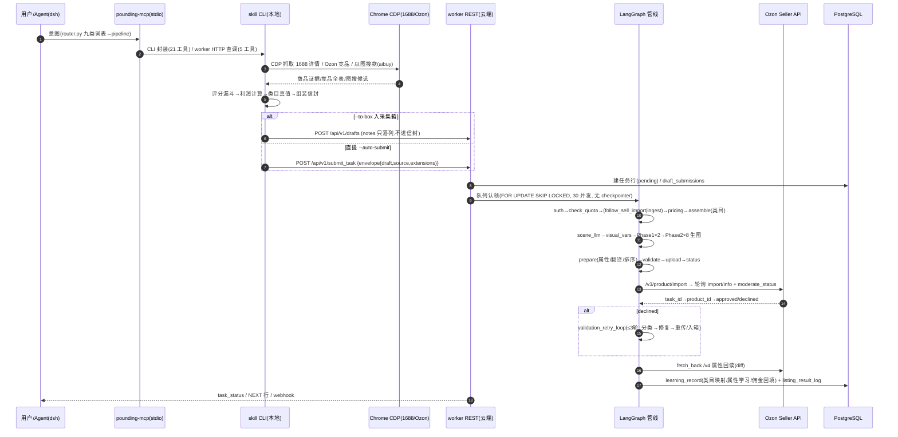
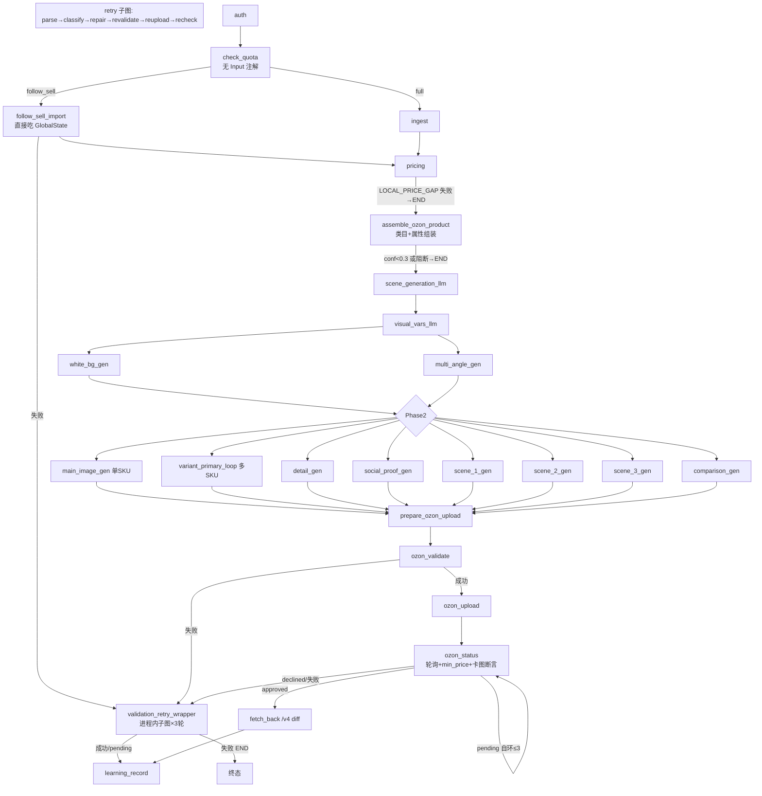

# ozon-worker 架构全景（ARCHITECTURE 文档集）

> 口径基线：dev 工作区 **v0.80.0+**，2026-09-25 全量重梳（九路并行深读 + 关键锚点人工抽查）。
> 所有 `文件:行号` 锚点为当次快照，会随代码演进漂移；语义以锚点所在函数为准。
> 与存量文档的关系：`docs/ARCHITECTURE-TOPOLOGY.md`（v0.27 业务模型拓扑，正文偏旧）与
> `docs/ARCHITECTURE.html`（archify 组件总览交互图）是**组件级**视图；本目录是**函数级**细节，互为补充。

## 文档索引

| 文件 | 覆盖域 |
|---|---|
| `01-skill-line.md` | skill 侧：CLI 命令矩阵 / GraphInput 信封全键 / 选品引擎 / 货源匹配 / 类目真值 / 重量尺寸真值 / 门禁 / follow 链 |
| `02-worker-graph.md` | worker 骨架：LangGraph 装配 / 22 节点出入参全卡 / 路由函数 / 任务生命周期 / checkpoint / GlobalState / API 面+鉴权矩阵 / MCP 映射 |
| `03-category-chain.md` | 类目信任序（Skill→L0→L1→R2b）/ R1 敏感闸 / R4 换类目 / 学习闭环 / 决策树 |
| `04-attribute-chain.md` | 特征属性填充链（A1-A7）/ 出口闸 / 字典三桶 / 值匹配 / bounds 学习 |
| `05-pricing-chain.md` | 三档定价公式 / 佣金解析链 / 物流费率 / 汇率三级 / min_price 地板 |
| `06-image-chain.md` | 图来源五分类 / 生图计划与 10 节点 / 出口硬闸链 / COS 链 / retry 图片 / 收尾断言 |
| `07-model-matrix.md` | LLM/Vision/生图调用矩阵（24 调用点）/ config 全表 / 余额判定链 / 台账 / 失败分类 |
| `08-selection-follow-ecosystem.md` | discover/follow 跨端时序 / 数据池 / 会话代管 / 店铺线 / MCP 双面 / webui 面 |
| `09-findings.md` | **问题暴露清单**：Top 10 先修 + 分域全清单（新旧问题分离、分级标注） |

## 一图流：从对话到上架

## worker 主图拓扑（与 `worker/src/graphs/graph.py:52-453` 对应）

> ⚠️ `STAGE_ORDER`（main.py:91-95）是**展示顺序**不是拓扑顺序：check_quota 实际在 auth 后第二跳；
> `_NODE_STAGE_MAP`（task_processor.py:289-300）缺 7+ 个节点名 → 进度条倒退，见 `09-findings.md` #2。

## 核心不变式（横切纪律，改代码前对照）

1. **唯一入口**：定价 `utils/pricing_estimate.compute_price`、标题公式 `utils/title_formula`、佣金 `utils/commission_resolver`、错误码 `api/errors.py`、图来源 `utils/image_source.py`、锁 `skill/scripts/lib/lock_utils.py`——禁止内联复制。
2. **langgraph Input 过滤**：节点/路由要读的 state 字段必须声明进该节点 Input model，否则静默拿不到（W8/P2-2b 双实证）。
3. **防洗卡**：一切 `/v3/product/import` POST 出口必须接 `preserve_existing_card_attributes`；新增 import 出口必须接。
4. **原图不上卡**：`_enforce_payload_image_policy` 是唯一上卡闸；参考≠上卡；跟卖竞品图只做生图参考。
5. **宁缺毋滥**：字典值多候选不盲采（unique_or_none）；空图诚实失败不上原图（E1 默认停用）。
6. **零假 completed**：终态必须过 `_has_real_product_evidence`（T0.4）；Output 默认值归零；error_code 必须声明进 Output 才能透传。
7. **R1 红线**：敏感子树 veto 覆盖所有层，唯一豁免 `_resolved_by_path`；veto 出口不入箱。
8. **notes 是运营态**：绝不进信封 payload/extensions，worker 零业务消费。
9. **采集箱即权威**：`extensions.box_reviewed` 禁一切自主重配（R4/标题/描述重写）。
10. **生产库纪律**：测试禁打生产 `worker.mxou.cn`；prod_db_guard 哨兵闸；宿主直连 15433 非 5433。

## 全局门禁地图（速查；细节见各分域文档）

| 层 | 门禁 | 位置 | 不通过行为 |
|---|---|---|---|
| skill | `_heavy_gate` 跨进程锁 | cli.py:640 | exit 4；`--wait` 排队 / `--force` 跳 |
| skill | `_source_preflight` 反爬/源失效 | cloud_probe.py:1206 | exit 3；`--to-box` 放行 |
| skill | `--min-margin` / `--min-density` | cli.py:852,894 | exit 3 |
| skill | `_category_guess_consistent` 毒类目自校验 | cloud_probe.py:1338 | 不写 draft.ozon_category |
| worker | auth token/余额 | auth_node.py:148 | failed（AUTH_* 码） |
| worker | check_quota 店铺配额 | check_quota_node.py:22 | `[QUOTA_BLOCKED]` → END |
| worker | ingest 空标题 | ingest_node.py:82 | failed_stage=ingest |
| worker | 受限品类双命中（manual/page 豁免） | assemble:1511,2065 | 入箱 LOCAL_RESTRICTED_CATEGORY |
| worker | R1 敏感 veto | assemble:692 | failed LOCAL_SENSITIVE_CATEGORY（不入箱） |
| worker | R2b 低置信/弃权 | assemble:1917 | 入箱 LOCAL_CATEGORY_MATCH_FAILED |
| worker | 价差守卫 ≥10× | pricing_node.py:455 | 入箱 LOCAL_PRICE_GAP_BLOCKED |
| worker | 值数闸 `cap_attribute_values` | attr_value_sanitize.py:76 | 截断（8229 恒 1） |
| worker | 数值语义闸 `sanitize_numeric_semantics` | attr_fill_extras.py:453 | 22390 禁填；8513/11650/23249>200 剥 |
| worker | 零图硬闸 `LOCAL_IMAGES_MISSING` | ozon_upload_node.py:286 | CREATE 无图不发请求 |
| worker | 图片出口闸 `_enforce_payload_image_policy` | prepare:2026 | IMAGE_GEN_ALL_FAILED |
| worker | 重传闸 `_reupload_gate_blocked` ×3 出口 | validation_retry_loop.py:3824 | 违规图不 POST |
| worker | 卡图断言 `card_image_assert` | ozon_status_node.py:523 | CARD_IMAGE_MISMATCH 拒假成功 |
| worker | 终态佐证闸 T0.4 | task_processor.py:84 | PRODUCT_NOT_CREATED |

## 台账 / 留存 / 学习 表地图

| 表 | 写入点 | 用途 |
|---|---|---|
| `ozon_product_tasks` | task_processor.submit_task:394 | 任务主行（FOR UPDATE SKIP LOCKED 认领） |
| `draft_submissions` | main.py:2039 直连 / draft_service 采集箱 | 提交对账（state 归位） |
| `product_drafts`（采集箱） | blocked_draft_box.create_draft:98 | 阻断入箱（tenant+item_id 幂等） |
| `listing_result_log` | listing_result_log.py:147（终态三路挂点） | 终态真值：dc/tp/error_code/moderation_texts/final_weight/dims |
| `category_match_log` | assemble:4256 | 匹配审计：layer/confidence/candidates（blocked 6 处也写） |
| `attr_match_log` | attr_match_log.py:24（仅 prepare 链 8 处打点） | 属性缺口榜 |
| `mxou_call_ledger` | mxou_ledger_service.record_call | 模型调用记账（model/tenant/outcome/duration） |
| `category_mapping` | local_db_manager.add_category_mapping:592 | L0 学习表（W11 全局共享，原子 upsert） |
| `attribute_learning` | learning_record:481 | 属性映射学习 |
| `attr_bounds_learned` | attr_numeric_sanitize.py:172 | 拒单原文→数值边界学习 |
| `category_commission` | commission_resolver.upsert:266 | 类目×价格段佣金缓存 |
| `task_generated_images` | task_image_cache | 生图缓存（(task,slot,version)，7 天清理） |
| `sku_metrics_pool` | sku_metrics_pool_service | 数据池（只存指标永不存 cookie，W11） |
| `ozon_sessions` | ozon_session_service | 会话代管（AES-256-GCM aad=tenant:credential） |
| `shop_usage_stats` | task_processor:175 | 店铺用量埋点 |

## 本轮梳理暴露的问题

全清单与分级见 **`09-findings.md`**。Top 5（详见 findings）：
1. 🔴 变体生图失败回退 1688 原图 → 撞上出口硬闸 → **整单 IMAGE_GEN_ALL_FAILED**（毒化整单）
2. 🔴 `_NODE_STAGE_MAP` 缺 assemble 等 7+ 节点 → **进度条从高位跳回 0%**（每单必现）
3. 🔴 `validation_retry_loop.py:2051-2054` **UnboundLocalError**（标题修复支路可被打断）
4. 🟠 OutOfQuota 吞异常回归口 ×5（A5/vision 推断/revalidate 翻译/ai_field_service）
5. 🟠 follow/discover-降级/search 三条腿信封注入口径不一致（缺模板定价键/缺 preflight/绕门禁）
