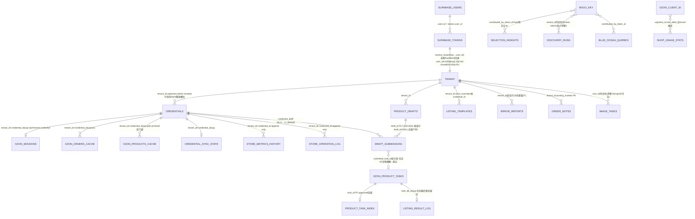

# A8 — 用户资产映射与对账规则审计（v0.74.0 基线）

> 审计代理：glm-5.3-flash 调研执行层 · 2026-09-11 · 主题：用户资产归属映射 / 生产孤儿与错绑扫描 / MXOU 余额对账规则
> 仓库：`/Volumes/os/dev/ozon-worker-gov`（v0.74.0）· 只读审计，未做任何 git 操作

**总体结论**：资产归属的**密码学绑定是强项**——凭证/会话密文 AAD=`tenant:client` 使跨租户解密必然失败（`utils/credential_cipher.py`），`get_decrypted` 跨租户 404、店铺跨租户绑定 409（`services/credential_service.py`）。但归属链有**三处结构性缺口**：①draft_submissions 表**没有 tenant_id 列**，归属全靠 draft FK / submitted_task_id 软引用，任务 30 天物理删后直连行（draft_id=NULL）变成无法归租户的完全悬空行；②tenant_id 同名列在 discovery_runs 存的是 **clean token 明文**而非 Supabase user_id（列名语义漂移），且 selection_insights 等四表以 **MXOU key 本体**（contributed_by_token_id）作数据列落库；③**MXOU 余额完全单侧记账**——余额在 api.mxou.cn（newapi）侧，worker 只读（`get_mxou_balance` 多级降级，绝不回写），本地**零消耗流水、零对账**，402 争议只能靠碎片日志。生产扫描因 SSH 不可达降级为「已验证语法的查询脚本交付」（§7），三组孤儿/错绑/租户漂移探针待实跑。

---

## 1. 生产访问声明（SSH 探测记录）

| 时间（CST） | 命令 | 结果 |
|---|---|---|
| 2026-09-11 01:31:32 | `ssh -o BatchMode=yes -o ConnectTimeout=5 root@124.222.160.253 'echo ok'` | `Connection timed out during banner exchange` |
| 2026-09-11 01:31:32 | `ssh -o BatchMode=yes -o ConnectTimeout=5 root@worker.mxou.cn 'echo ok'` | `Connection closed by 198.18.0.251 port 22`（本机代理 fake-IP，`~/.ssh/config` 无 Host 条目） |
| 早前尝试 | `ubuntu@124.222.160.253` | `Connection closed`（服务器侧立即断开，疑似 fail2ban/白名单） |

**结论：SSH 只读通道不可达（本机出口被立即断开 + 域名解析被本地代理劫持）。按铁律不硬闯，降级为「设计+查询脚本交付」**。§7 全部查询已按只读纪律书写（仅 SELECT/COUNT/GROUP BY，带 LIMIT，不触大 JSONB 列），可在任何可达通道原样执行；执行时须逐条附时间戳。

---

## 2. 用户资产映射关系图



**孤立可能标注（每条边的断点）**：
- `draft_submissions → ozon_product_tasks`：软引用（Text 列非 FK）。任务 completed 30 天后物理删（`main.py:1122`），其 submission 行永久留存但 join 不到任务——F-D04 归位（`main.py:1125`）只能修「任务在」的行。
- `draft_submissions` 直连行（`main.py:1614`，draft_id=NULL）：租户既无本表列也无 draft 可达，唯一途径是 submitted_task_id→tasks.tenant_id，任务删除后**三方皆断**。
- `ozon_sessions/orders_cache/products_cache/sync_state → credentials`：credential_id 无 FK 约束（纯 UUID 列），credential 行 rotate 产生 `client:revoked:xxx` 后缀旧行后，这些子表行仍指向**旧行 id**（语义上「活数据挂在已吊销凭证上」）。
- `credentials`：无外键到任何用户表——tenant_id 是纯字符串，Supabase 删用户/删 token 后凭证及其子树全部成为「无主资产」（worker 侧无级联，也不会报错）。

---

## 3. 资产表清单与归属字段（model.py 实测）

### 3.1 租户隔离类（tenant_id = Supabase user_id 字符串，String(50)）

| 表 | 归属列 | 归属强化 | 生命周期风险 |
|---|---|---|---|
| ozon_product_tasks | tenant_id | idx+部分唯一(tenant,sku_key) | completed 30d 物理删（`main.py:1122`） |
| product_drafts | tenant_id | idx(tenant,updated_at) | 手动删，永久 |
| draft_submissions | **无 tenant_id** | draft_id FK CASCADE | 任务删后悬空（§4.3） |
| credentials | tenant_id | uq(tenant,client)+uq(tenant) is_default | revoked 行保留审计 |
| product_task_index | tenant_id | idx(tenant,offer_id) | — |
| listing_templates | tenant_id | uq(tenant) is_default | — |
| order_notes / order_messages | tenant_id | idx | — |
| error_reports | tenant_id | idx | v0.73 已知：旧行是哈希租户 |
| ozon_orders_cache / ozon_products_cache | tenant_id+credential_id | uq 三列 | 凭证吊销后残留（§4.4） |
| credential_sync_state / store_metrics_history / store_operation_log | tenant_id+credential_id | uq/idx | data_erasure 可清（管理端默认关） |
| listing_result_log | tenant_id | task_db_id uq | 任务删后唯一事实留存（30d 清理不再丢数据） |
| ozon_sessions | tenant_id+credential_id | uq 双列 | aad=tenant:credential，换 key 后如实 expired |

### 3.2 用户隔离类（非 tenant_id 命名）

| 表 | 归属列 | 问题 |
|---|---|---|
| selection_insights | contributed_by_token_id | **存 MXOU key 明文**（去 sk- 前缀），uq(keyword,token) |
| blue_ocean_queries / ozon_bestsellers / market_bestsellers | contributed_by_token_id | 同上；榜单读端点已全局共享（v0.57 W4b） |
| discovery_runs | tenant_id（**实为 clean token**，列注释自认「上报用户 clean token」） | 列名语义漂移；GET 全局共享并把该值回显为 contributed_by_token_id（`main.py:2577`） |
| image_tasks / audit_logs | user_id（String(100) 可空） | 与 tenant_id 同语义不同名不同长度，无一致性校验 |

### 3.3 全局共享类（无租户列，平台知识）

attribute_cache / dictionary_value_cache / category_cache / category_tree_nodes / web_category_path_map / category_mapping（W11 全局共享）/ category_commission / attribute_synonym / domain_hint / logistics_rates / size_mappings / exchange_rates / shop_usage_stats（按 ozon_client_id 聚合，**无租户**：店铺换绑租户后用量历史不可分割）/ data_sources / site_banners / site_announcements / sku_metrics_pool / warm_dead_nodes。

---

## 4. 关键链路审计

### 4.1 resolve_tenant 派生链（`services/tenant_service.py`）

- 正链：token（剥 `sk-`）→ Supabase `tokens.user_id`（`deleted_at is null`）→ 60s LRU；**已配置 Supabase 时查询失败 fail-closed 503**（不误放行）；token 无效 401。
- 回退链：`get_supabase() is None`（本地/测试）→ `user_{sha256(key)[:16]}`（`key_derived_tenant`）。
- 风险点：①回退租户与正链租户**值域不同**——生产历史上两者都写过数据（v0.73 已知 error_reports 旧行是哈希租户，原 token 查不到旧报告），无合并迁移脚本，也无「哈希租户禁止新写入」的运行时守卫；②`_tenant_cache` 进程内 dict 无容量上限（多 token 长跑缓慢增长，量级小，P3）。

### 4.2 凭证加密与归属防线（`utils/credential_cipher.py` + `services/credential_service.py`）

- AES-256-GCM，AAD=`f"{tenant_id}:{ozon_client_id}"`——跨租户解密必然 InvalidTag（认证失败 raise，绝不返回静默垃圾）；密文带 `v1:` 版本前缀支持轮换；日志/异常零明文；`mask` 只回 `****{last4}`。
- `get_decrypted`（:324）：UUID 预检 + `tenant_id` 等值过滤 + `status='active'` → 跨租户/已吊销一律 404（**不泄漏存在性**）。解密失败 500 提示重配。
- 跨租户绑定拦截 `_assert_client_not_bound_elsewhere`（:50）：SELECT 预检同 client 被其他租户绑定 → 409。**代码注释自认「仅预检（无 DB 级锁），极端并发下可能双绑，记为已知残留」**——两租户并发绑定同一店时双 INSERT 均可成功（各自满足 uq(tenant,client)），之后一方解密必失败（AAD 不匹配）。
- rotate/revoke：旧行 `status='revoked'` + client 改写 `||':revoked:'||uuid[:8]` 释放唯一槽位（审计轨迹保留）。副作用：按 ozon_client_id join 的历史子表行（orders_cache 等）**不再能命中 credential 行**（client 已被改写）——孤儿扫描须按 credential_id 而非 client_id。

### 4.3 draft_submissions 归属传递与孤儿路径

- 采集箱行：`draft_service.py:903` INSERT（draft_id 非空）→ 归属经 draft FK CASCADE 可达，草稿删除时级联清理（无孤儿）。
- 直连行（`main.py:1594-1630`，A4 决策所有任务都有 submission 行）：`draft_id=NULL`，credential_id 由「tenant+client_id 查 active」内联解析（查不到则 NULL），submitted_task_id 软引用。**本表无 tenant_id 列**。
- 孤儿生成路径：①任务 completed 30 天物理删后，对应 submission 行 join 不到任务（r3 归位失效）；②写入侧「非致命」except（`main.py:1630`）失败不影响提交，可能缺行；③credential 后续 rotate，行内 credential_id 指向 revoked 旧行。
- 影响面：该表是 webui「上架状态」状态源（draft_service:296）与 has_active_submission 409 防重（draft_service:63）的依据——悬空行不影响功能但污染统计/取证。

### 4.4 生命周期清理 vs 资产悬空（`main.py:1093 _periodic_task_cleanup`，60s/轮）

| 对象 | 规则 | 悬空后果 |
|---|---|---|
| stale running | >30min：retry_count<max → pending+1；耗尽 → failed（有界，v0.26） | 无 |
| completed 任务 | 30 天物理删（事实已留存 listing_result_log） | draft_submissions.submitted_task_id 悬空 |
| task_generated_images | 7 天删 | 无引用方 |
| 凭证吊销 | 只改 credentials 行；**不级联** sessions/orders_cache/products_cache/sync_state/sync_jobs | 残留缓存永久留存（scheduler 只选 active 凭证 `store_sync_scheduler.py:143`，不再增长但不清旧）；唯一清理入口 data_erasure 管理端默认关闭（`ADMIN_HARD_DELETE_ENABLED`） |
| draft 删除 | FK CASCADE 清 submissions | 无 |

### 4.5 data_erasure 硬删除边界（`services/data_erasure_service.py`）

店级清理 16 张表（单事务、逐表存在性校验、store_operation_log 落 hard_delete 审计）；**明确保留** credentials 吊销行/草稿/order_notes。注意清单里的 `scheduled_listings/product_costs/order_line_costs/source_candidates/warehouse_cache` 等表**不在 model.py**（运行时存在性校验容忍缺表）——schema 漂移已在 DB-SCHEMA-AUDIT 登记。清单不含 `ozon_sessions`：管理端硬删某店时**会话密文残留**（密文无 key 不可解，但占存储且语义上属该店资产），建议补入 STORE_SCOPED_TABLES（P2 探针可验证）。

---

## 5. MXOU 余额链审计（worker 只读不写确认）

| 环节 | 位置 | 行为 |
|---|---|---|
| 平台实查 | `mxou_api.py:1027 get_mxou_balance` | GET `api.mxou.cn/v1/dashboard/billing/subscription`；字面 balance≤0 先 consult soft/hard_limit（v0.64.1 B1：订阅哨兵 0 非欠费→降级 None）；仅「负数且无 limit」判真欠费；无 balance 字段→`/api/user/self` quota 换算→limit 哨兵→None 降级 |
| 事中缓存 | `mxou_api.py:305 _check_balance_cached` | 30s TTL + **token 指纹绑定**（多用户不互污）；0.0 特判二次直查防缓存固化（B2）；查询失败→inf fail-open |
| 事前判定 | `main.py:1280 _check_mxou_balance` | MXOU 实查优先；失败降级 Supabase users.quota（unlimited 放行）；**绝不用 tokens.remain_quota**（僵尸字段） |
| 402 归因 | `main.py:1358 _balance_source_label` | {mxou_real, mxou_session, supabase, unknown}——只读 30s 缓存不发 HTTP |
| 低余额告警 | `mxou_api.py:369 _alert_low_balance` | <BALANCE_ALERT_THRESHOLD(¥50)，token 指纹 30min 去重，TASK_NOTIFY_URL webhook，失败仅日志 |
| 永久错误 | `mxou_api.py:338` | 401/403/余额关键词 → OUT_OF_QUOTA 不重试不降级（防重复烧额度） |

**确认：worker 全链只读余额，无任何回写/扣减端点；无本地消耗流水表**（shop_usage_stats 记任务次数不记费用；仅 `_alert_low_balance` 和 402 文案留有日志痕迹，日志有保留期且非结构化）。因此「MXOU 平台侧扣费 vs worker 侧调用」之间**不存在任何对账机制**——这是 A8 的核心缺口。

---

## 6. MXOU 本地流水 + 对账方案设计（核心交付）

### 6.1 流水表 DDL（新表 `mxou_call_ledger`，遵循新表纪律：append-only + init_data 自动建）

```sql
CREATE TABLE IF NOT EXISTS mxou_call_ledger (
    id          BIGINT GENERATED ALWAYS AS IDENTITY PRIMARY KEY,
    tenant_id   VARCHAR(50)  NOT NULL,            -- resolve_tenant 结果，与资产表同源
    token_fp    VARCHAR(16)  NOT NULL,            -- sentry_setup._token_fingerprint，绝不落明文 key
    kind        VARCHAR(16)  NOT NULL,            -- chat | image
    model       VARCHAR(64),
    billed      BOOLEAN      NOT NULL DEFAULT TRUE,  -- 重试耗尽后的最终尝试；MXOU 侧对失败是否计费以平台为准
    success     BOOLEAN      NOT NULL,
    error_code  VARCHAR(40),                      -- OUT_OF_QUOTA / violation / timeout…
    duration_ms INTEGER,
    created_at  TIMESTAMPTZ  NOT NULL DEFAULT NOW()
);
CREATE INDEX IF NOT EXISTS idx_mcl_tenant_created ON mxou_call_ledger (tenant_id, created_at DESC);
CREATE INDEX IF NOT EXISTS idx_mcl_fp_created     ON mxou_call_ledger (token_fp, created_at DESC);
-- 保留期 90d，挂 _periodic_task_cleanup 同款定时删除（按 created_at）
```

**记账粒度（关键）**：一次真实模型调用=一行，埋在 `call_mxou_chat_api`（`mxou_api.py:123`）与 `call_mxou_image_api`/`_call_image_with_model` 的**最终尝试出口**（成功/永久失败/重试耗尽三处 return 前）。注意三点：①`_check_balance_cached` 是查询不是计费，**不记账**；②MCP「一次调用记 2 次」是限流计数（Bearer 中间件+内层路由双层），**与计费无关**，流水表绝不沿用该口径；③生图内部多次重试按最终结果记 1 行（重试中间态 MXOU 可能已计费，差异归入 §6.4 容差）。
**tenant 获取**：`mxou_api` 层拿不到 tenant——用 contextvars（task_processor 每任务 set 一次）或给两函数加可选 `tenant_id` 参数（调用方均已有 tenant），二者取后者更直白。

### 6.2 对账脚本（`worker/scripts/reconcile_mxou.py`，只读 + 出报告）

双通道，A 优先 B 兜底：
- **A 用量 API**：`GET api.mxou.cn/v1/dashboard/billing/usage?start_date=&end_date=`（OpenAI 兼容口径，newapi 是否实现须实测；404/字段缺失→走 B）。窗口内平台总额 vs `SUM(mxou_call_ledger)`（按 token_fp 分组）。
- **B 余额差分（权威兜底，只依赖已验证的 subscription 端点）**：T0 与 T1 各取一次 `get_mxou_balance`（同 token），`platform_charge = B(T0) − B(T1) + 充值`；本地 `local_charge = SUM(ledger)`；充值事件从 webhook/Sentry 无源，**先人工登记充值表或跳过含充值的窗口**。
- 频率：每日增量 + 每周全窗口；输出 `{token_fp, window, platform, local, diff, diff_ratio}`，超阈值（建议 ¥1 或 5%）→ 复用 `_alert_low_balance` 同款 TASK_NOTIFY_URL 通道发 `type: mxou_reconcile_mismatch`。

### 6.3 差异处置

1. diff ≤ 容差 → 记录 accepted（流水表补一行 `kind='reconcile'` 汇总行，留审计）。
2. 容差 < diff ≤ 3× 容差 → 检查已知未记账路径：生图重试中间态计费、b64→COS 转存类辅助调用、MXOU 侧模型价目调整。
3. diff 持续为正（平台多扣）且归因失败 → 以 MXOU 为权威（本方案设计原则：**流水做归因不做退款依据**），按 token_fp 出周报，走 `report`/error_reports 流程联系平台。
4. diff 为负（本地多于平台）→ 记账 bug（多为重复记账/漏记 success=false），修埋点后人工核销。

参考先例：`DESIGN-PHASE2-PURCHASE-ADS-RECONCILIATION.md` §3 的 Ozon 结算对账（24h job、差额阈值、mismatch 清单、手工核销写 operation_log）与本方案同构；PRD-store-sync 验收「迁移行数对账 0 丢失」的计数口径可平移。

---

## 7. 生产只读扫描脚本（SSH 不可达，待执行；容器名/PG 密码见服务器 `deploy/.env`）

```bash
# 进入 PG（DEPLOY.md 拓扑：worker+PG 同 compose）
docker exec -it <postgres容器> psql -U postgres -d ozon
```

```sql
-- S1 孤儿 draft_submissions：引用任务已不存在（30 天删/写失败）
SELECT COUNT(*) AS orphan_submissions FROM draft_submissions ds
WHERE ds.submitted_task_id IS NOT NULL
  AND NOT EXISTS (SELECT 1 FROM ozon_product_tasks t WHERE t.id::text = ds.submitted_task_id);
-- 抽样 5 行（含直连行占比：draft_id IS NULL 即完全无法归租户的行）
SELECT id::text, draft_id::text, submitted_task_id, status, created_at FROM draft_submissions ds
WHERE ds.submitted_task_id IS NOT NULL
  AND NOT EXISTS (SELECT 1 FROM ozon_product_tasks t WHERE t.id::text = ds.submitted_task_id)
ORDER BY created_at DESC LIMIT 5;

-- S2 吊销/缺失凭证的残留资产（按 credential_id join，勿按 client_id——revoked 行已改写 client）
SELECT 'ozon_sessions' AS t, COUNT(*) AS residue FROM ozon_sessions s
  LEFT JOIN credentials c ON c.id = s.credential_id WHERE c.id IS NULL OR c.status='revoked'
UNION ALL SELECT 'ozon_orders_cache', COUNT(*) FROM ozon_orders_cache s
  LEFT JOIN credentials c ON c.id = s.credential_id WHERE c.id IS NULL OR c.status='revoked'
UNION ALL SELECT 'ozon_products_cache', COUNT(*) FROM ozon_products_cache s
  LEFT JOIN credentials c ON c.id = s.credential_id WHERE c.id IS NULL OR c.status='revoked'
UNION ALL SELECT 'credential_sync_state', COUNT(*) FROM credential_sync_state s
  LEFT JOIN credentials c ON c.id = s.credential_id WHERE c.id IS NULL OR c.status='revoked';

-- S3 跨租户异常：同店多租户绑定（错绑/双绑实证）+ revoked 后缀行 + 会话指向 revoked
SELECT ozon_client_id, COUNT(DISTINCT tenant_id) AS tenants FROM credentials
WHERE status='active' GROUP BY ozon_client_id HAVING COUNT(DISTINCT tenant_id) > 1 LIMIT 20;
SELECT COUNT(*) AS revoked_pattern_rows FROM credentials WHERE ozon_client_id LIKE '%:revoked:%';

-- S4 任务表租户分布：哈希租户(user_+16hex) vs 数字租户(Supabase user_id) 占比 → 租户漂移遗迹规模
SELECT CASE WHEN tenant_id ~ '^user_[0-9a-f]{16}$' THEN 'hash_legacy'
            WHEN tenant_id ~ '^[0-9]+$' THEN 'supabase_numeric'
            ELSE 'other' END AS kind, COUNT(*) AS cnt
FROM ozon_product_tasks GROUP BY 1 ORDER BY 2 DESC;
SELECT tenant_id, COUNT(*) AS cnt FROM ozon_product_tasks GROUP BY 1 ORDER BY 2 DESC LIMIT 10;
-- 同口径跑 error_reports（v0.73 已知旧行哈希租户，量化待迁移行数）

-- S5 tenant_id 双语义盘点：discovery_runs 的「tenant_id」实为 token
SELECT COUNT(*) AS total,
       COUNT(*) FILTER (WHERE tenant_id ~ '^user_[0-9a-f]{16}$') AS hash_like,
       COUNT(*) FILTER (WHERE tenant_id ~ '^sk?') AS sk_like
FROM discovery_runs;

-- S6 无主凭证：tenant_id 既非数字也非哈希（异常值盘点）
SELECT DISTINCT tenant_id FROM credentials
WHERE tenant_id !~ '^[0-9]+$' AND tenant_id !~ '^user_[0-9a-f]{16}$' LIMIT 20;
```

```bash
# S7 余额对账素材：最近 7 天 402/低余额日志（只读 grep；容器名按实际）
docker logs --since 168h <worker容器> 2>&1 | grep -E "余额不足|低余额|402|BALANCE_ALERT|balance" | tail -80
# MXOU 平台侧消耗无法从 worker 读取（api.mxou.cn 无 worker 可用的用量端点实证前），
# 对账素材以 §6.2 方案 B（余额差分）补齐——需两次时点采样，属后续运维动作非本审计可代办。
```

---

## 8. 发现清单（P0-P3）

| # | 级别 | 发现 | 证据 | 影响面 | 修复建议 | 探针 |
|---|---|---|---|---|---|---|
| F1 | **P1** | MXOU 余额单侧记账：本地零消耗流水、零对账，402 争议无法归因 | §5 全链只读确认；`_BALANCE_CACHE` 30s 内存态；无 ledger 表 | 全体计费用户（生产用户数待 S4 量化；单用户烧钱异常只能靠 Sentry 401/403 事后发现） | 落地 §6 方案（ledger 表 + 双通道对账 + 容差处置），纯增量无破坏性 | §7 S7 + §6.2 首次差分采样 |
| F2 | **P1** | 生产历史租户漂移遗迹未清：哈希租户与数字租户双身份并存，无合并/迁移/守卫 | `key_derived_tenant` 回退链仍在代码路径（tenant_service.py:30）；v0.73 已知 error_reports 旧行哈希租户查不到 | 涉及全部 v0.62.4 前写入的历史行（行数待 S4）；取证/统计口径割裂，跨身份汇总失真 | ①一次性迁移脚本（哈希租户行按 token 反查归并）或②读侧兼容视图；③运行时对 `user_` 前缀新写入告警 | §7 S4 两条 SQL |
| F3 | **P1** | 跨租户绑店拦截非原子（代码自认），并发窗口双绑 → 409 失守且一方解密必失败 | credential_service.py:57 注释「仅预检（无 DB 级锁），极端并发下可能双绑，记为已知残留」 | 概率低但后果为用户可见失败+需人工修数；S3 若实证 >0 则升级 P0 | `pg_advisory_xact_lock(hashtext(ozon_client_id))` 包住预检+INSERT；或全局部分唯一索引 `ON credentials(ozon_client_id) WHERE status='active'`（需先清历史双绑） | §7 S3 第一条 |
| F4 | **P2** | draft_submissions 无 tenant_id 列；直连行(draft_id=NULL)任务 30 天删后三方断链、永久悬空 | model.py:678 表定义无租户列；main.py:1614 直连 INSERT draft_id=NULL；main.py:1122 任务物理删 | 孤儿行随时间累积；webui 统计/取证不可归租户 | 补 `tenant_id` 列新行起写入（旧行经 task 反查一次性回填）；补 S1 巡检到 ci/运维脚本 | §7 S1 两条 |
| F5 | **P2** | 凭证吊销/轮换不级联 store-scoped 数据：sessions/orders/products/sync_state 残留；data_erasure 默认关且清单缺 ozon_sessions | revoke 只改 credentials 行（credential_service.py:219）；scheduler 只选 active（store_sync_scheduler.py:143）；data_erasure_service.STORE_SCOPED_TABLES 无 ozon_sessions | revoked 店残留缓存永久占存储（含会话密文）；无自动清理 | ①revoke 时可选级联清理（用户确认）；②STORE_SCOPED_TABLES 补 ozon_sessions；③定期审计残留在库 | §7 S2 四合一 |
| F6 | **P2** | MXOU key 本体作数据列落库：selection_insights/blue_ocean/bestsellers 的 contributed_by_token_id 及 discovery_runs.tenant_id 均存 clean token 明文 | model.py:1101 注释「上报用户 token（去 sk- 前缀后的 key）」；main.py:2577 回显该值 | DB 泄露即用户 MXOU 凭证泄露（key 可直接消费余额）；全局共享读端点回显 key 给其他用户 | 改存 token_fp（16 hex 已够去重语义）；存量列一次性哈希化迁移；读端点只回 fp | §7 S5 |
| F7 | **P3** | 租户列命名/类型三套并存：tenant_id(String50)/user_id(String100 可空)/contributed_by_token_id(Text) | model.py image_tasks/audit_logs vs 其余表 | 跨表 join 归因需人工翻译；新表易再犯 | 约定写入 DB-SCHEMA-AUDIT（已有 §表分类，补「列名映射」行）并纳入新表纪律 review | 文档对照即可 |
| F8 | **P3** | shop_usage_stats 全局按 client_id 聚合无租户维度；ozon_product_tasks.sku_key 内嵌 user_id | model.py:626 uq(ozon_client_id,stat_date)；:74 sku_key={user_id}:{product_id} | 店铺换绑租户后用量历史串户；漂移租户下 sku_key 去重失配 | 低优；换绑场景写文档known-issue；sku_key 待租户漂移(F2)修复后自然收敛 | S3+S4 交叉 |
| F9 | **P3** | _tenant_cache 无界 dict（每 token 一条，TTL 60s 但条目不淘汰） | tenant_service.py:23 | token 量大时缓慢内存增长（量级小，千级 token 仅 MB） | 换 LRU（functools/自定义 cap 1万）即可 | 长跑内存曲线 |

**P0 空缺说明**：未发现现存的跨租户越权读写通道——所有读路径均带 tenant 等值过滤（get_decrypted/forensics/error_reports 等四端点 v0.73 已切 resolve_tenant），密文 AAD 提供最后一道密码学防线；F3 双绑属并发窗口且代码已自认待修，故列 P1 而非 P0。若 §7 S3 实跑发现既存双绑行，F3 立即升 P0（真实错绑用户资产）。
